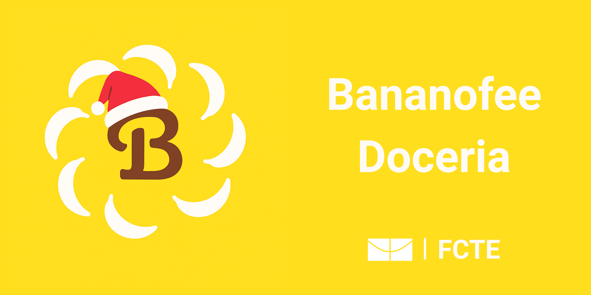
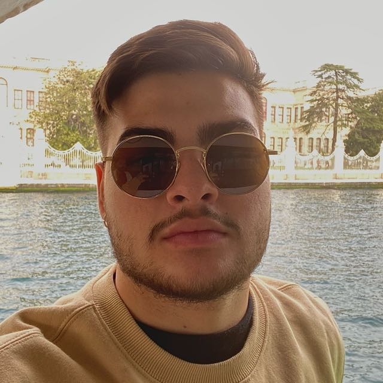
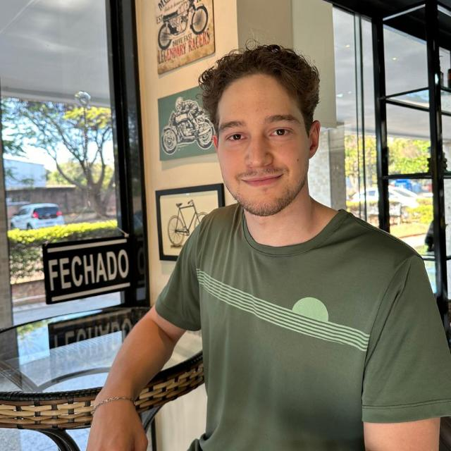
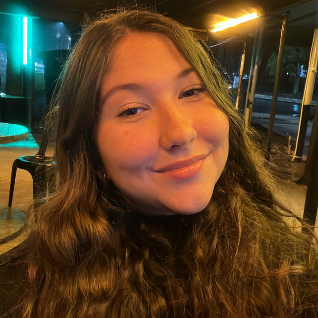

# Projeto Bananoffee

Este projeto foi desenvolvido como parte da disciplina de **Requisitos de Software** do curso de Engenharia de Software, semestre **2025/1**, **Turma 2**, ministrada pelo docente George Marsciano Correa.

## Introdução

O presente trabalho tem como objetivo propor, documentar e planejar a implementação de um sistema personalizado para a empresa **Bananoffee Doceria**, especializada na produção e venda de tortas artesanais sob encomenda e para pronta entrega. 

O foco do projeto está no **levantamento e especificação de requisitos** para a construção de uma plataforma digital (site) que permitirá a automatização e organização dos pedidos, reservas, pagamentos e gestão administrativa da empresa.

A iniciativa busca substituir o atual fluxo de atendimento, realizado manualmente via WhatsApp, por uma solução mais eficiente, intuitiva e automatizada, otimizando tanto a experiência dos clientes quanto o controle interno da produção e vendas.

## Objetivos Gerais

- Automatizar o processo de pedidos e reservas de tortas;
- Reduzir o tempo gasto com atendimento via mensagens;
- Melhorar a organização e previsibilidade da produção diária;
- Oferecer um painel administrativo para controle de vendas e estoque;
- Integrar formas de pagamento online, como Pix com QR Code.

## Integrantes do grupo

  <!-- Pessoa 1 -->
<a href="https://github.com/Brunocrzz" style="text-decoration: none; color: inherit;">
  

    
    <h3>Bruno Garcia</h3>
    
Líder do grupo Desenvolvedor Frontend

  

</a> 

<a href="https://github.com/guilhermezan42" style="text-decoration: none; color: inherit;">
  

    
    <h3>Guilherme Zanella</h3>
    
Desenvolvedor Frontend

  

</a> 

<a href="https://github.com/fabiofonteles1" style="text-decoration: none; color: inherit;">
  

    
    <h3>Fábio Santos</h3>
    
Desenvolvedor Frontend

  

</a> 

<a href="https://github.com/marcoslbz" style="text-decoration: none; color: inherit;">
  

    
    <h3>Marcos Bezerra</h3>
    
Desenvolvedor Backend

  

</a> 

<a href="https://github.com/mrodrigues14" style="text-decoration: none; color: inherit;">
  

    
    <h3>Matheus Rodrigues</h3>
    
Desenvolvedor Backend

  

</a> 

<a href="https://github.com/nanecapde" style="text-decoration: none; color: inherit;">
  

    
    <h3>Anne Capdeville</h3>
    
Desenvolvedor Backend

  

</a> 

---
## Histórico de Versão
| Data     | Versão | Descrição             | Autor          |
| -------- | ------ | --------------------- | -------------- |
| 17/04/25 | 1.0    | Criação do Documento  | Marcos Bezerra |
| 19/04/25 | 1.1    | Ajustes e estilização | Bruno Cruz     |