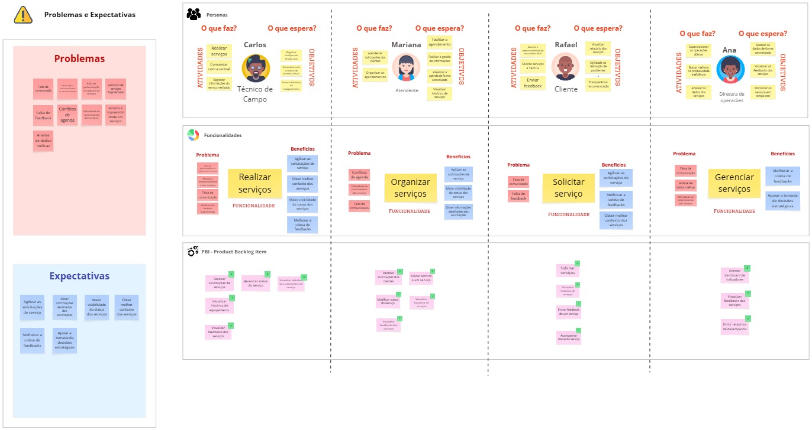
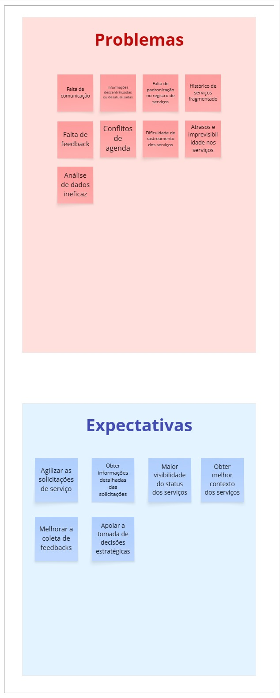
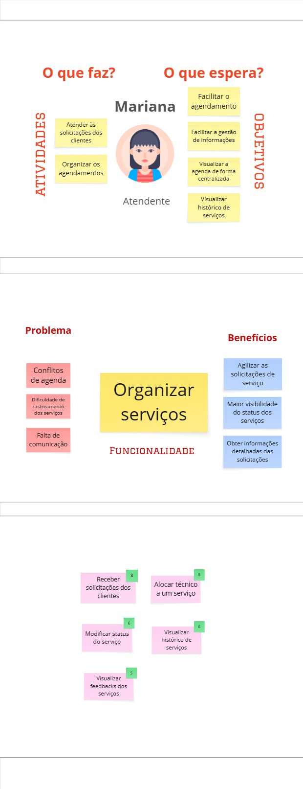
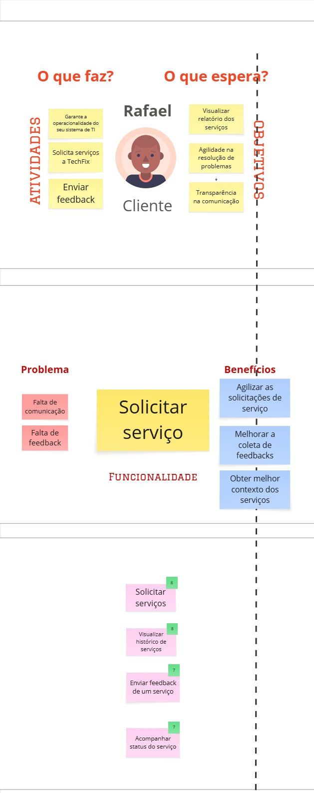
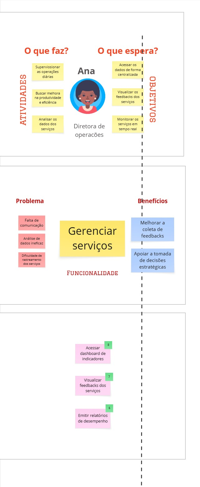

# PBB

**O que é PBB?**

Product Backlog Building (PBB) é a prática de detalhar e priorizar itens de backlog de produto de forma colaborativa, garantindo que o time de desenvolvimento entenda claramente as funcionalidades necessárias, seus critérios de aceitação e cenários de teste (BDD). O PBB auxilia na comunicação entre stakeholders, no planejamento de entregas e na definição de qualidade esperada para cada User Story.

## PBB Canvas

## Problemas e Expectativas identificadas

As funcinoalidades foram organizadas por persona, as imagens a seguir contêm as personas com suas atividades e objetivos, e logo abaixo a sua funcinoalidade associada e seu conjunto de PBIs
## Carlos - Técnico de Campo

## Mariana - Atendente

## Rafael - Cliente

## Ana - Diretora de operações

## PBB Canvas - Miro
Segue o mesmo quadro PBB Canvas no miro para melhor visualização

  <iframe width="768" height="432" src="https://miro.com/app/live-embed/uXjVIpB5v8g=/?embedMode=view_only_without_ui&moveToViewport=-21130,-9910,14446,11810&embedId=665492763069" frameborder="0" scrolling="no" allow="fullscreen; clipboard-read; clipboard-write" allowfullscreen></iframe>

---

## User Stories (US)

- **US01**: Como Técnico, posso receber solicitações de serviços para agilizar as solicitações de serviço.
- **US02**: Como Técnico, posso ver detalhes dos serviços para obter informações detalhadas das solicitações.
- **US03**: Como Técnico, posso gerenciar o status do serviço (solicitado, em andamento, pausado, concluído, cancelado) para maior visibilidade do status dos serviços.
- **US04**: Como Técnico, posso visualizar o histórico do equipamento para obter melhor contexto dos serviços.
- **US05**: Como Técnico, posso visualizar feedbacks dos serviços anteriores para melhorar a coleta de feedbacks.
- **US06**: Como Atendente, posso receber novas solicitações dos clientes em tempo real para agilizar as solicitações de serviço.
- **US07**: Como Atendente, posso alocar um técnico a um serviço para agilizar as solicitações de serviços.
- **US08**: Como Atendente, posso alterar o status do serviço para maior visibilidade do status dos serviços.
- **US09**: Como Atendente, posso visualizar o histórico de serviços para obter melhor contexto dos serviços.
- **US10**: Como Atendente, posso visualizar os feedbacks dos serviços para melhorar a coleta de feedbacks.
- **US11**: Como Cliente, posso solicitar serviços para agilizar as solicitações de serviços.
- **US12**: Como Cliente, posso visualizar histórico de serviços prestados para obter melhor contexto dos serviços.
- **US13**: Como Cliente, posso enviar feedback de um serviço para melhorar a coleta de feedbacks.
- **US14**: Como Cliente, posso acompanhar o status do meu serviço para maior visibilidade do status dos serviços.
- **US15**: Como Diretora, posso acessar um painel com indicadores de desempenho e satisfação para apoiar a tomada de decisões estratégicas.
- **US16**: Como Diretora, posso visualizar os feedbacks dos serviços no meu dashboard para melhorar a coleta de feedbacks.
- **US17**: Como Diretora, posso emitir relatórios de desempenho consolidados para apoiar a tomada de decisões estratégicas.

---

## Critérios de Aceitação

### US03: Como Técnico, posso gerenciar o status do serviço (solicitado, em andamento, pausado, concluído, cancelado) para maior visibilidade do status dos serviços.
- No modal dos serviços, é possível alterar o status do serviço entre solicitado, em andamento, pausado, concluído ou cancelado.
- Se o técnico escolher “Concluído”, abre automaticamente um formulário de conclusão no qual ele deve informar o horário de conclusão (data e hora), confirmar que o equipamento foi reparado (checkbox), descrever o que foi feito (texto livre) e coletar a assinatura ou confirmação digital do cliente — sem o preenchimento completo desses campos, o serviço não será marcado com status concluído.
- Se o técnico escolher “Cancelado”, aparece um modal de confirmação “Tem certeza que deseja cancelar este serviço?” antes de aplicar.
- Após selecionar e confirmar o novo status, a alteração é salva, refletindo automaticamente no Grid de Serviços e na tela do cliente, sem precisar recarregar a página.

### US04: Como Técnico, posso visualizar o histórico do equipamento para obter melhor contexto dos serviços.
- Na área de detalhes do serviço, exibe um botão ou aba “Histórico de Intervenções do Equipamento X”.
- Ao clicar/expandir, o sistema lista todas as intervenções daquele equipamento em ordem decrescente de data, mostrando data/hora, técnico e descrição resumida.

### US06: Como Atendente, posso receber novas solicitações dos clientes em tempo real para agilizar as solicitações de serviço.
- Quando o cliente criar um chamado, o Grid de Serviços exibirá um alerta, com nome do cliente, tipo de serviço e localização.
- No alerta aparece o botão “Alocar técnico”, que ao ser clicado abre uma tela de detalhes da solicitação.

### US07: Como Atendente, posso alocar um técnico a um serviço para agilizar as solicitações de serviços.
- No Grid de Serviços, ao selecionar o serviço, haverá um botão “Alocar Técnico”, que exibirá uma lista de técnicos disponíveis, ordenada pela distância.
- Ao alocar um técnico para o serviço, o status é alterado automaticamente de “Solicitado” para “Em andamento”.

### US08:  Como Atendente, posso alterar o status do serviço para maior visibilidade do status dos serviços.
- No Grid de Serviços, o atendente pode mudar o status de um chamado diretamente para: “Solicitado”, “Em andamento”, “Pausado”, “Concluído” ou “Cancelado”.
- Ao alterar o status, o técnico alocado e o cliente recebem uma notificação push.

### US11:  Como Cliente, posso solicitar serviços para agilizar as solicitações de serviços.
- Ao acessar “Solicitar Serviço”, o cliente vê um formulário com:
  - Tipo de Serviço (dropdown)
  - Descrição Detalhada do problema
  - Seleção de Urgência (Normal ou Emergencial)
  - Indicação do Equipamento e local
  - Opção de anexar até 3 arquivos (PDF, DOCX, JPG, PNG de até 5 MB cada)
- Após enviar, aparece mensagem “Solicitação enviada com sucesso” mostrando o número de protocolo.
- O novo chamado surge imediatamente em “Minhas Solicitações” com status “Solicitado”.

### US13: Como Cliente, posso enviar feedback de um serviço para melhorar a coleta de feedbacks.
- Para serviços com status “Concluído”, aparece o botão “Enviar Feedback” que abre um formulário contendo:
  - Nota (estrelas de 1 a 5, obrigatório)
  - Comentário (texto livre, mínimo de 5 caracteres)
  - Opção de anexar até 2 arquivos (PDF, DOCX, JPG ou PNG de até 5 MB cada)
  - O botão “Enviar” só é ativado após a nota ser selecionada.
- Ao submeter, o cliente vê a mensagem “Obrigado pelo seu feedback!”.
- Em caso de não envio do feedback em 48 horas, é enviado um lembrete via email para o cliente.

### US15: Como Diretora, posso acessar um painel com indicadores de desempenho e satisfação para apoiar a tomada de decisões estratégicas.
- O painel exibe métricas atualizadas como: número total de serviços realizados, tempo médio de atendimento, percentual de SLAs cumpridos e média de satisfação dos clientes.
- Os dados são apresentados de forma visual (gráficos e painéis de destaque), para agilizar a interpretação e entendimento.
- No dashboard, haverá o Grid de Serviços para visualização dos serviços.

### US17: Como Diretora, posso emitir relatórios de desempenho consolidados para apoiar a tomada de decisões estratégicas.
- Diretora escolhe diário, semanal ou mensal antes de gerar relatório.
- Relatório deve ser gerado no formato PDF ou Excel com métricas presentes no dashboard (número total de serviços realizados, tempo médio de atendimento, percentual de SLAs cumpridos e média de satisfação dos clientes).
- Diretora pode agendar envio automático do relatório para os colaboradores via e‑mail no início de cada período.

---

## BDD

### US03: Como Técnico, posso gerenciar o status do serviço (solicitado, em andamento, pausado, concluído, cancelado) para maior visibilidade do status dos serviços.

#### CENÁRIO 1: Falha ao concluir sem preencher todos os campos obrigatórios
- **DADO QUE** o técnico abriu o modal de um serviço e selecionou “Concluído”  
- **E** o formulário de conclusão foi exibido com os campos:
    - Horário de conclusão (data e hora)
    - Confirmação de reparo (checkbox)
    - Descrição do trabalho (textarea)
    - Assinatura do cliente (upload de imagem)  
- **QUANDO** ele submeter o formulário preenchendo:
    - Horário de conclusão: “2025-06-20 14:30”
    - Confirmação de reparo: marcado
    - Descrição do trabalho: **em branco**
    - Assinatura do cliente: **não anexada**  
- **ENTÃO** o sistema **não** altera o status do serviço  
- **E** exibe a mensagem “Preencha todos os campos de conclusão antes de encerrar”  
- **E** destaca em vermelho os labels “Descrição do trabalho” e “Assinatura do cliente”

#### CENÁRIO 2: Falha ao concluir com formato de dado inválido
- **DADO QUE** o técnico abriu o modal de um serviço e selecionou “Concluído”  
- **E** o formulário de conclusão foi exibido  
- **QUANDO** ele submeter o formulário preenchendo:
    - Horário de conclusão: “ontem às três” (texto livre)
    - Confirmação de reparo: marcado
    - Descrição do trabalho: “Troca de filtro”
    - Assinatura do cliente: imagem válida  
- **ENTÃO** o sistema **não** altera o status do serviço  
- **E** exibe a mensagem “Insira data e hora no formato DD/MM/AAAA HH:MM”  
- **E** destaca em vermelho o campo “Horário de conclusão”

#### CENÁRIO 3: Sucesso ao concluir serviço com formulário completamente válido
- **DADO QUE** o técnico abriu o modal de um serviço e selecionou “Concluído”  
- **E** preencheu o formulário de conclusão com:
    - Horário de conclusão: “20/06/2025 14:30”
    - Confirmação de reparo: marcado
    - Descrição do trabalho: “Substituição de válvula e teste de pressão OK”
    - Assinatura do cliente: imagem JPG de 300 KB  
- **QUANDO** ele clicar em “Salvar”  
- **ENTÃO** o status do serviço muda para “Concluído”  
- **E** o Grid de Serviços e a tela do cliente atualizam imediatamente para “Concluído”

#### CENÁRIO 4: Cancelar serviço após confirmação
- **DADO QUE** o técnico abriu o modal de um serviço e selecionou “Cancelado”  
- **QUANDO** ele confirmar a ação no modal “Tem certeza que deseja cancelar este serviço?”  
- **ENTÃO** o status do serviço muda para “Cancelado”  
- **E** o Grid de Serviços e a tela do cliente refletem o cancelamento

### US06: Como Atendente, posso receber novas solicitações dos clientes em tempo real para agilizar as solicitações de serviço.

#### CENÁRIO 1: Exibir alerta ao receber nova solicitação
- **DADO QUE** estou na Tela de Grid de Serviços mostrando os chamados existentes
- **E** o cliente “Empresa Alpha” cria um chamado do tipo “Manutenção Preventiva” em “Unidade X”
- **QUANDO** o chamado for registrado no sistema
- **ENTÃO** aparece instantaneamente um alerta no Grid de Serviços
- **E** o alerta mostra “Empresa Alpha”, “Manutenção Preventiva” e “Unidade X”
- **E** exibe o botão “Alocar técnico”

#### CENÁRIO 2: Abrir detalhes da solicitação a partir do alerta
- **DADO QUE** o alerta com o botão “Alocar técnico” está visível no Grid de Serviços
- **QUANDO** eu clicar em “Alocar técnico”
- **ENTÃO** deve abrir a Tela de Detalhes da Solicitação
- **E** a Tela de Detalhes exibe cliente, tipo de serviço, localização, data e urgência

### US11: Como Cliente, posso solicitar serviços para agilizar as solicitações de serviços.

#### CENÁRIO 1: Sucesso ao enviar solicitação com todos os campos válidos
- **DADO QUE** o cliente está na Tela de “Solicitar Serviço”  
- **E** preencheu:
    - Tipo de Serviço: “Manutenção Corretiva”
    - Descrição Detalhada: “Motor não liga ao acionar”
    - Urgência: “Emergencial”
    - Equipamento/Local: “Equipamento A123”
    - Anexou arquivos: “foto_problema.jpg” (JPEG, 1,2 MB) e “manual_técnico.pdf” (PDF, 450 KB) 
  
- **QUANDO** clicar no botão “Enviar”  
- **ENTÃO** o sistema mostra “Solicitação enviada com sucesso — Protocolo #20250620-001”  
- **E** o novo chamado aparece imediatamente em “Minhas Solicitações” com status “Solicitado”

#### CENÁRIO 2: Falha ao tentar enviar sem preencher campos obrigatórios
- **DADO QUE** o cliente deixou em branco o campo “Descrição Detalhada”  
- **QUANDO** clicar em “Enviar”  
- **ENTÃO** o sistema **não** envia a solicitação  
- **E** exibe mensagem “Preencha a descrição do problema para continuar”  
- **E** realça em vermelho o campo “Descrição Detalhada”

#### CENÁRIO 3: Falha ao anexar arquivo com tipo ou tamanho inválido
- **DADO QUE** o cliente tenta anexar:
    - “video.mp4” (MP4, 10 MB)
- **QUANDO** clicar em “Enviar”  
- **ENTÃO** o sistema **não** envia a solicitação  
- **E** exibe mensagem “Anexe apenas PDF ou JPG de até 5 MB”  
- **E** remove o arquivo inválido da lista de anexos

### US13: Como Cliente, posso enviar feedback de um serviço para melhorar a coleta de feedbacks.

#### CENÁRIO 1: Sucesso ao enviar feedback com todos os campos válidos
- **DADO QUE** o serviço está com status “Concluído” na “Minhas Solicitações”  
- **E** o cliente clica no botão “Enviar Feedback”  
- **E** preenche:
    - Nota: 4 estrelas
    - Comentário: “Atendimento rápido e eficiente” (≥ 15 caracteres)
    - Anexo: “evidência.jpg” (JPG, 1 MB)  
- **QUANDO** clicar em “Enviar”  
- **ENTÃO** o sistema mostra “Obrigado pelo seu feedback!”  
- **E** registra nota, comentário e anexo no perfil do serviço

#### CENÁRIO 2: Falha ao não selecionar nota ou comentário insuficiente
- **DADO QUE** o cliente:
  - **não** selecionou nenhuma estrela  
  **OU** escreveu “OK” (2 caracteres) no comentário  
- **QUANDO** clicar em “Enviar”  
- **ENTÃO** o sistema **não** envia o feedback  
- **E** exibe “Selecione uma nota de 1 a 5 e escreva ao menos 5 caracteres”  
- **E** destaca em vermelho os campos inválidos

#### CENÁRIO 3: Envio de lembrete após 48 horas sem feedback
- **DADO QUE** se passaram 48 horas desde que o serviço foi concluído  
- **E** o cliente ainda não enviou feedback  
- **QUANDO** o sistema processar a rotina diária de lembretes  
- **ENTÃO** é enviado um e‑mail automático para o cliente com:
    - Assunto: “Lembrete: Avalie seu serviço Concluído”
    - Link direto ao formulário de feedback

### US17: Como Diretora, posso emitir relatórios de desempenho consolidados para apoiar a tomada de decisões estratégicas.

#### CENÁRIO 1: Sucesso ao gerar relatório diário
- **DADO QUE** a Diretora está na tela de “Relatórios”
- **E** escolheu o período “Diário”
- **QUANDO** ela clicar em “Gerar Relatório”
- **ENTÃO** o sistema deve baixar um arquivo PDF com as métricas do dashBoard
- **E** também disponibilizar um arquivo Excel com as mesmas métricas

#### CENÁRIO 2: Falha ao tentar gerar sem selecionar período
- **DADO QUE** a Diretora está na tela de “Relatórios”
- **E** não selecionou “Diário”, “Semanal” ou “Mensal”
- **QUANDO** ela clicar em “Gerar Relatório”
- **ENTÃO** o sistema não inicia a geração
- **E** exibe a mensagem “Selecione um período antes de gerar o relatório”

#### CENÁRIO 3: Agendar envio automático de relatório semanal
- **DADO QUE** a Diretora está na tela de “Relatórios”
- **E** escolheu o período “Semanal”
- **E** ativou a opção “Agendar Envio Automático” para enviar toda segunda-feira às 08:00
- **QUANDO** ela confirmar o agendamento
- **ENTÃO** o sistema salva essa configuração
- **E**, na próxima segunda-feira às 08:00, dispara um e‑mail com o PDF e Excel do relatório para os colaboradores cadastrados
---
**Link** do documento: [Docs  PBB](https://docs.google.com/document/d/10B9g2QVqakeqG3C8XdcdnXFoff1pt-fjiVhFaxJFQq4/edit?tab=t.lh8sudvmf7y5)
---

## Histórico de Versão

| Data     | Versão | Descrição             | Autor              |
| -------- | ------ | --------------------- | ------------------ |
| 19/06/25 | 1.0    | Criação do Documento  | Marcos Bezerra     |
| 20/06/25 | 1.1    | Atualizando os benefícios  | Marcos Bezerra|
| 20/06/25 | 1.2    | Atualizando o BDD  | Marcos Bezerra|
| 13/07/25 | 1.3    | Atualizações da Issue 22  | Marcos Bezerra|

