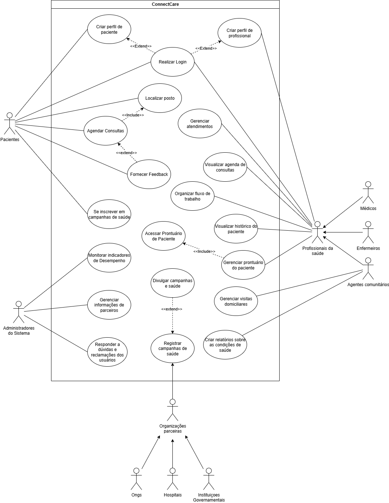

# Diagrama de casos de uso - ConnectCare

## Diagrama de casos de uso - Miro
Segue o mesmo diagrama UML mas na plataforma miro, para melhor visualização

<iframe width="768" height="432" src="https://miro.com/app/live-embed/uXjVIhhQSTE=/?embedMode=view_only_without_ui&moveToViewport=-8963,-946,3383,3383&embedId=747747756137" frameborder="0" scrolling="no" allow="fullscreen; clipboard-read; clipboard-write" allowfullscreen></iframe>

| Data     | Versão | Descrição             | Autor              |
| -------- | ------ | --------------------- | ------------------ |
| 02/07/25 | 1.0    | Criação do Documento  | Bruno Garcia, Guilherme Zanella e Marcos Bezerra     |
| 13/07/25 | 1.1    | Colocando em UML  | Marcos Bezerra     |