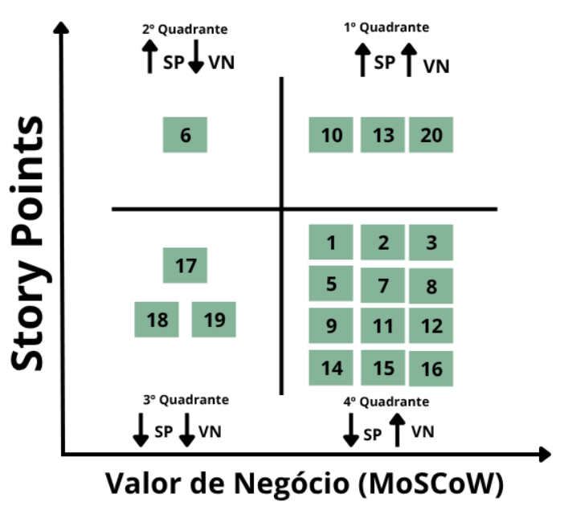

# Backlog do Produto

## Backlog Geral

O backlog do produto é um repositório vivo e priorizado que reúne todos os requisitos, funcionalidades, melhorias e correções necessárias para o desenvolvimento contínuo do sistema. Ele atua como um guia central para a equipe, orientando o que deve ser feito em cada etapa do projeto. Essa lista é constantemente revisada e atualizada, acompanhando a evolução do produto e respondendo a novas demandas e aprendizados, mantendo o alinhamento entre equipe e objetivos do projeto.
Essa configuração da logística de escrita das histórias de usuários se justifica pelo fato do processo de engenharia selecionada pela equipe: ScrumXP, conforme descrito na seção de [Estratégias de Engenharia de Software](../visaoDoProduto/estrategiasEngSoft.md). Em resumo, os Requisitos Funcionais são detalhados com mais profundidade durante a fase de Sprint Planning, momento em que as histórias de usuário são escritas no formato _"Eu como (agente), gostaria de (ação), para que (agregação de valor)"_.

No centro do backlog estão as User Stories (US), ou histórias de usuário. Elas são descrições simples e objetivas das necessidades dos usuários finais, escritas de forma a serem compreendidas por todos os envolvidos no desenvolvimento. Cada história busca responder a três perguntas principais: quem é o usuário, o que ele quer fazer e qual benefício essa ação traz. Esse modelo garante que o foco se mantenha na entrega de valor real ao usuário.

Algumas histórias, por envolverem um conjunto maior de funcionalidades ou maior complexidade, são agrupadas em Épicos. Um épico representa uma necessidade mais abrangente e, por isso, é dividido em várias histórias menores que detalham os passos necessários para sua implementação. Esse desmembramento facilita o entendimento do escopo e a definição de prioridades dentro do processo iterativo de desenvolvimento.

Além disso, o backlog também está organizado por Temas, que agrupam épicos e histórias com objetivos semelhantes ou pertencentes à mesma área funcional do sistema. Os temas fornecem uma visão macro do produto, contribuindo para uma organização mais estratégica do desenvolvimento e facilitando a priorização por grandes áreas de valor. Ao contrário dos épicos, que possuem um escopo mais específico, os temas são categorias mais amplas que ajudam a estruturar o backlog de forma lógica e coesa.

### Temas

| Código | Título                   | Descrição                                                                                                                                 |
| ------ | ------------------------ | ----------------------------------------------------------------------------------------------------------------------------------------- |
| TM01   | Conta do Usuário e Admin | Funcionalidades para cadastro, autenticação e gerenciamento da conta do usuário e uso do sistema pelo administrador.                      |
| TM02   | Fluxo de Compra          | Funcionalidades para gerenciar e visualizar o catálogo de produtos da doceria e montagem, além do acompanhamento e pagamento dos pedidos. |

---

### Épicos

| Código | Tema | Título                                         | Descrição                                                                                                                                    |
| ------ | ---- | ---------------------------------------------- | -------------------------------------------------------------------------------------------------------------------------------------------- |
| EP01   | TM01 | Cadastro e Autenticação                        | Funcionalidades que permitem aos usuários criarem uma conta no sistema e realizarem login de forma segura para acessar suas funcionalidades. |
| EP02   | TM01 | Gerenciar Conta de Usuário                     | Permite que usuários autenticados e administradores atualizem seus dados pessoais e mantenham a segurança de acesso ao sistema.              |
| EP03   | TM02 | Gerenciar Cardápio                             | Funcionalidades voltadas ao administrador para cadastrar, editar e remover itens do cardápio, mantendo o menu sempre atualizado.             |
| EP04   | TM02 | Gerenciar Sacola de Compras                    | Permite ao cliente montar seu pedido adicionando, alterando e removendo itens da sacola antes de finalizar a compra.                         |
| EP05   | TM02 | Gestão de Pedidos e Pagamentos (Administrador) | Funcionalidades voltadas ao controle e gerenciamento dos pedidos e pagamentos por parte do administrador.                                    |
| EP06   | TM02 | Jornada do Cliente: Pedido e Pagamento         | funcionalidades que contemplam a experiência do cliente no processo de compra, acompanhamento e avaliação do pedido.                         |

---

### User Stories dos Requisitos Funcionais

| Código | Requisito Funcional | Épico Associado | User Story                                                                                                    |
| ------ | ------------------- | --------------- | ------------------------------------------------------------------------------------------------------------- |
| US01   | RF08                | EP01            | Como novo usuário, quero me cadastrar para acessar as funcionalidades do sistema.                             |
| US02   | RF09                | EP01            | Como usuário, quero realizar login no sistema para acessar minhas funcionalidades.                            |
| US03   | RF11                | EP02            | Como usuário autenticado, quero alterar minha conta para atualizar minhas informações pessoais.               |
| US04   | RF12                | EP02            | Como usuário autenticado, quero excluir minha conta para encerrar meu uso do sistema.                         |
| US05   | RF01                | EP03            | Como administrador, quero adicionar um item no cardápio digital para manter o menu sempre atualizado.         |
| US06   | RF02                | EP03            | Como administrador, quero excluir um item do cardápio digital para remover produtos indisponíveis.            |
| US07   | RF03                | EP03            | Como administrador, quero alterar um item no cardápio digital para atualizar informações do produto.          |
| US08   | RF10                | EP03            | Como cliente, quero visualizar o cardápio digital para escolher produtos de forma fácil e rápida.             |
| US09   | RF13                | EP04            | Como cliente, quero adicionar produtos na sacola virtual para montar meu pedido.                              |
| US10   | RF14                | EP04            | Como cliente, quero remover produtos da sacola virtual para ajustar meu pedido.                               |
| US11   | RF15                | EP04            | Como cliente, quero alterar produtos da sacola virtual para modificar meu pedido antes da finalização.        |
| US12   | RF04                | EP05            | Como administrador, quero alterar o status de um pedido para mudar a etapa do processo de produção do pedido. |
| US13   | RF05                | EP05            | Como administrador, quero visualizar um pedido para acompanhar detalhes e confirmar informações.              |
| US14   | RF06                | EP05            | Como administrador, quero visualizar relatório de pagamentos recebidos para controle financeiro.              |
| US15   | RF07                | EP05            | Como administrador, quero alterar a chave PIX da doceria para atualizar informações de pagamento.             |
| US16   | RF16                | EP06            | Como cliente, quero realizar um pedido para efetuar a compra dos produtos selecionados.                       |
| US17   | RF17                | EP06            | Como cliente, quero acompanhar o status do pedido para saber em que etapa ele se encontra.                    |
| US18   | RF18                | EP06            | Como cliente, quero visualizar meu histórico de pedidos para consultar compras anteriores.                    |
| US19   | RF19                | EP06            | Como cliente, quero avaliar um pedido para dar feedback e melhorar o serviço.                                 |
| US20   | RF20                | EP06            | Como cliente, quero realizar pagamento de pedido via PIX para concluir a compra de forma segura e rápida.     |

---

### Requisitos Não Funcionais

#### Requisitos de Usabilidade

| **ID** | **Descrição do Requisito de Usabilidade**                                                                                                                                                                                                                                     |
| ------ | ----------------------------------------------------------------------------------------------------------------------------------------------------------------------------------------------------------------------------------------------------------------------------- |
| RNF01  | O sistema deve permitir que usuários localizem facilmente o cardápio, histórico de pedidos e área de login por meio de uma navegação com ícones visuais para melhorar a compreensão, assim até mesmo usuários com pouca familiaridade digital terão facilidade na utilização. |
| RNF02  | A interface deve exibir feedbacks visuais claros ao adicionar ou remover itens da sacola, realizar login ou confirmar pedidos.                                                                                                                                                |
| RNF03  | A interface deve ser responsiva e adaptável a diferentes dispositivos (smartphones, tablets, desktops).                                                                                                                                                                       |
| RNF04  | O sistema deve oferecer instruções claras durante o fluxo de pedido e pagamento.                                                                                                                                                                                              |
| RNF05  | Os botões e elementos interativos devem ser facilmente clicáveis e legíveis em qualquer dispositivo.                                                                                                                                                                          |
| RNF06  | A interface principal deve destacar os principais produtos e promoções, além de facilitar o acesso ao histórico de pedidos e status.                                                                                                                                          |
| RNF07  | O sistema deve ser acessível para usuários com diferentes níveis de habilidade técnica, com botões claros e sem sobrecarga de informações.                                                                                                                                    |
| RNF08  | As cores da interface devem seguir a paleta visual da Bananoffee Doceria, refletindo a identidade da marca, com contraste adequado para legibilidade.                                                                                                                         |
| RNF09  | A tipografia utilizada no sistema deve seguir o padrão visual da marca, priorizando fontes legíveis e consistentes entre as telas.                                                                                                                                            |
| RNF10  | O QR Code do PIX deve ser claramente visível e facilmente escaneável.                                                                                                                                                                                                         |
| RNF11  | O processo de pagamento deve ser intuitivo, com instruções claras sobre como realizar o PIX.                                                                                                                                                                                  |
| RNF12  | O sistema deve exibir o valor do pagamento de forma destacada e clara.                                                                                                                                                                                                        |

#### Requisitos de Confiabilidade

| **ID** | **Descrição do Requisito de Confiabilidade**                                                                                        |
| ------ | ----------------------------------------------------------------------------------------------------------------------------------- |
| RNF13  | O sistema deve permitir recuperação automática em caso de queda de conexão durante a finalização do pedido.                         |
| RNF14  | O sistema deve notificar o usuário se algum erro ocorrer durante o processo de pagamento, garantindo que o pedido não seja perdido. |
| RNF15  | A aplicação deve manter os dados dos usuários e pedidos salvos em caso de falhas.                                                   |
| RNF16  | O status dos pedidos deve refletir com precisão as atualizações feitas pelo administrador em tempo real.                            |
| RNF17  | O sistema deve estar disponível pelo menos 99,5% do tempo por mês (uptime), monitorado continuamente.                               |
| RNF18  | O sistema deve manter log de todas as transações PIX para auditoria.                                                                |
| RNF19  | Em caso de falha na geração do PIX, o sistema deve permitir nova tentativa imediatamente.                                           |

#### Requisitos de Suportabilidade

| **ID** | **Descrição do Requisito de Suportabilidade**                                                                                |
| ------ | ---------------------------------------------------------------------------------------------------------------------------- |
| RNF20  | O sistema deve ser desenvolvido com tecnologias modernas (Next.js, NestJS) para facilitar a manutenção e evolução do código. |
| RNF21  | A aplicação deve seguir uma arquitetura modular para facilitar a adição de novas funcionalidades.                            |
| RNF22  | O sistema deve ter documentação básica que permita a continuidade do desenvolvimento por novos membros da equipe.            |
| RNF23  | O código-fonte deve estar versionado em repositório Git com histórico de mudanças.                                           |
| RNF24  | A base de dados deve permitir consultas eficientes e bem estruturadas com uso de MongoDB.                                    |
| RNF25  | O sistema deve permitir a atualização de categorias e produtos sem necessidade de interrupção do serviço.                    |

#### Requisitos de Segurança

| **ID** | **Descrição do Requisito de Segurança**                                                                                   |
| ------ | ------------------------------------------------------------------------------------------------------------------------- |
| RNF26  | O sistema deve criptografar senhas dos usuários antes de armazená-las no banco de dados.                                  |
| RNF27  | O login deve utilizar autenticação segura, com tokens JWT para sessões autenticadas.                                      |
| RNF28  | As rotas administrativas devem ser protegidas e acessíveis apenas para usuários autenticados com perfil de administrador. |
| RNF29  | As requisições de pagamento devem ser protegidas com HTTPS e validação de origem confiável.                               |
| RNF30  | O sistema deve expirar automaticamente sessões inativas após 30 minutos.                                                  |
| RNF31  | Deve haver verificação de duplicidade no cadastro para evitar múltiplas contas com o mesmo e-mail.                        |
| RNF32  | O sistema deve gerar códigos PIX únicos e seguros para cada transação.                                                    |
| RNF33  | As informações de pagamento devem ser criptografadas durante a transmissão.                                               |
| RNF34  | O código PIX deve ter validade máxima de 30 minutos após a geração.                                                       |

## Priorização do Backlog Geral e MVP

Para a construção da priorização do backlog geral do sistema **Bananoffee**, a equipe optou por utilizar a técnica **MoSCoW**, conforme descrito no processo de [Engenharia de Requisitos](../visaoDoProduto/engenhariaderequisitos.md#analise-e-consenso), no módulo de Análise e Consenso. Essa abordagem é amplamente reconhecida em metodologias ágeis e auxilia na identificação das funcionalidades essenciais para o **Mínimo Produto Viável (MVP)**, bem como aquelas que podem ser adiadas para versões futuras.

### Técnica MoSCoW

A técnica **MoSCoW** categoriza os requisitos em quatro níveis de prioridade:

- **Must Have (M)** – _Deve Ter_: Funcionalidades **obrigatórias** para o sistema funcionar minimamente. Sem elas, o produto não pode ser entregue.
- **Should Have (S)** – _Deveria Ter_: Funcionalidades **importantes**, mas que podem ser adiadas, se necessário.
- **Could Have (C)** – _Poderia Ter_: Funcionalidades **desejáveis**, que agregam valor, mas não são críticas para o funcionamento básico.
- **Won’t Have (W)** – _Não Terá por agora_: Funcionalidades **não serão implementadas na versão atual**, podendo ser consideradas no futuro.

### Processo de Priorização

A priorização foi definida a partir de reuniões com a equipe de desenvolvimento e do alinhamento com os objetivos do cliente. Foram considerados dois fatores principais:

- **Valor para o negócio e experiência do usuário**, conforme expressado pelo cliente e pelos objetivos do sistema.
- **Viabilidade técnica e esforço estimado**, calculado com base em **Story Points**, que representam o esforço necessário para a implementação de cada funcionalidade, considerando complexidade técnica, volume de trabalho e incertezas.

A classificação MoSCoW foi aplicada a todos os **Requisitos Funcionais (RF)**.

### Capacidade Técnica da Equipe

Com base nas últimas 3 sprints realizadas, a equipe demonstrou uma capacidade técnica de:

- **9,75 Story Points por sprint**

Considerando 6 sprints para a entrega do MVP:

- **Capacidade total estimada**: `9,75 x 6 = 59 Story Points`

Esse valor é utilizado como limite de esforço para definir as funcionalidades que poderão compor o MVP.

### Utilização do Gráfico Valor de Negócio × Story Points

Para apoiar o processo de priorização do backlog e definição do MVP, foi utilizado um gráfico de **Valor de Negócio (MoSCoW)** versus **Story Points**. Essa matriz é uma ferramenta visual que auxilia na identificação de funcionalidades que oferecem o **melhor equilíbrio entre impacto para o cliente e esforço de desenvolvimento**.

O gráfico é dividido em quatro quadrantes:

- **1º Quadrante – **Alto Valor / Alto Esforço**
Funcionalidades que geram grande valor para o negócio, mas que exigem alto esforço de desenvolvimento. São importantes, porém podem ser planejadas para sprints posteriores, já que demandam mais tempo e recursos.

- **2º Quadrante – **Baixo Valor / Alto Esforço**
Funcionalidades com baixo retorno para o negócio e alto custo de implementação. Devem ser evitadas no MVP e só reconsideradas em versões futuras, se houver necessidade real ou mudança de contexto.

- **3º Quadrante – **Baixo Valor / Baixo Esforço**
Funcionalidades de fácil implementação, mas com baixo impacto. Podem ser incluídas caso sobre tempo no projeto, mas não são prioritárias para o MVP.

- **4º Quadrante – **Alto Valor / Baixo Esforço**
Esse é o **quadrante ideal para o MVP**. Contém funcionalidades que geram alto valor com baixo esforço de desenvolvimento. São as primeiras a serem selecionadas para implementação, pois oferecem maior retorno com menor investimento.

Ao cruzar esses dois critérios – **valor percebido pelo cliente** e **custo estimado em Story Points** – a equipe consegue tomar decisões mais assertivas, priorizando aquilo que realmente importa e garantindo entregas rápidas com impacto significativo.

Essa abordagem reforça os princípios ágeis de **maximizar valor e minimizar desperdícios**, favorecendo um ciclo de desenvolvimento mais eficiente e orientado às reais necessidades do projeto.

### Definição do MVP

O MVP será composto por funcionalidades que se localizam no **4º quadrante** do gráfico de **Valor de Negócio x Story Points**, ou seja:

**Critérios:**

- Alto valor de negócio (Must Have ou Should Have segundo MoSCoW)
- Baixo esforço de desenvolvimento (baixa pontuação de Story Points)

**Funcionalidades incluídas:**

- `RF1`, `RF2`, `RF3`, `RF5`, `RF7`, `RF8`, `RF9`, `RF11`, `RF12`, `RF14`, `RF15`, `RF16`

Essas funcionalidades serão entregues na primeira versão do sistema, garantindo entrega rápida de valor com menor complexidade e maior impacto para o usuário final.

#### Funcionalidades Planejadas para Futuras Iterações

As funcionalidades do **1º quadrante** possuem alto valor de negócio, mas alto custo de desenvolvimento (Story Points elevados). Elas serão desenvolvidas nas sprints finais, desde que o tempo e os recursos permitam.

**Critérios:**

- Alto valor de negócio
- Alto esforço (SP alto)

**Funcionalidades:**

- `RF10`, `RF13`, `RF20`

#### Funcionalidades Fora do MVP e com Menor Prioridade

As funcionalidades localizadas nos **quadrantes 2 e 3** não fazem parte do MVP nem da próxima etapa. Elas apresentam menor prioridade por:

**Critérios:**

- Story Points muito altos e/ou
- Baixo valor de negócio percebido

**Funcionalidades:**

- **2º quadrante**: `RF6`
- **3º quadrante**: `RF17`, `RF18`, `RF19`

Essas funcionalidades poderão ser reavaliadas futuramente com base em feedbacks dos usuários e disponibilidade de tempo/recursos da equipe.

### Priorização dos Requisitos

A priorização dos requisitos funcionais foi realizada em uma reunião colaborativa com:

- Stakeholders  
- Product Owner (PO)  
- Equipe de desenvolvimento

Durante a sessão, discutiram-se as **necessidades do negócio**, a **viabilidade técnica** e o **impacto para o usuário final**. Para apoiar esse processo, foram utilizados dois critérios principais:

- A técnica **MoSCoW**, para classificar os requisitos em níveis de prioridade (Must Have, Should Have, Could Have, Won’t Have).
- A estimativa de **Story Points**, utilizada para medir o esforço necessário para implementar cada funcionalidade, levando em conta a complexidade técnica, o volume de trabalho e as incertezas envolvidas.

Essa combinação permitiu identificar quais funcionalidades entregam **maior valor com menor esforço**, guiando o desenvolvimento incremental do sistema com foco em gerar valor no menor tempo possível. O cruzamento entre valor de negócio e Story Points também subsidiou a seleção dos requisitos que compõem o MVP.

#### Requisitos Funcionais para o Administrador

### Tabela de Priorização dos Requisitos

| Código | Requisito                                    | MoSCoW     | Story Points | MVP |
| ------ | -------------------------------------------- | ---------- | ------------ | --- |
| RF01   | Adicionar um item no cardápio digital        | Must Have  | 2            | x   |
| RF02   | Excluir um item no cardápio digital          | Must Have  | 2            | x   |
| RF03   | Alterar um item no cardápio digital          | Must Have  | 3            | x   |
| RF04   | Alterar o status de um pedido                | Won’t Have | 2            |     |
| RF05   | Visualizar um pedido                         | Must Have  | 3            | x   |
| RF06   | Visualizar relatório de pagamentos recebidos | Won’t Have | 5            |     |
| RF07   | Alterar chave pix da doceria                 | Must Have  | 1            | x   |

#### Requisitos Funcionais para o Usuário

### Tabela de Priorização dos Requisitos

| Código | Requisito                                       | MoSCoW     | Story Points | MVP |
| ------ | ----------------------------------------------- | ---------- | ------------ | --- |
| RF08   | Realizar cadastro no sistema                    | Must Have  | 2            | x   |
| RF09   | Realizar login no sistema                       | Must Have  | 2            | x   |
| RF10   | Visualizar o cardápio digital                   | Must Have  | 5            | x   |
| RF11   | Alterar conta de usuário                        | Must Have  | 3            | x   |
| RF12   | Excluir conta de usuário                        | Must Have  | 1            | x   |
| RF13   | Adicionar produtos na sacola virtual de compras | Must Have  | 5            | x   |
| RF14   | Remover os produtos da sacola virtual           | Must Have  | 2            | x   |
| RF15   | Alterar os produtos da sacola virtual           | Must Have  | 2            | x   |
| RF16   | Realizar pedido                                 | Must Have  | 3            | x   |
| RF17   | Acompanhar o status do pedido                   | Won’t Have | 2            |     |
| RF18   | Visualizar seu histórico de pedidos             | Could Have | 2            |     |
| RF19   | Avaliar um pedido                               | Won’t Have | 1            |     |
| RF20   | Realizar pagamento de pedido via pix            | Must Have  | 8            | x   |

# Referências Bibliográficas:

- MARSCICANO, George. Requisitos de Software - Fundamentos, Evolução e Práticas. 0.2, Draft. 2025
  
- http://www.extremeprogramming.org/

---
## Histórico de Versão:
| Data     | Versão | Descrição                                      | Autor      |
| -------- | ------ | ---------------------------------------------- | ---------- |
| 25/05/25 | 1.0    | Criação do Documento e adição do Backlog Geral | Bruno Cruz |
| /06/25   | 2.0    | Correção do backlog e do MVP                   | Bruno Cruz |
