Estes são os protótipos de alta e baixa fidelidade, desenvolvidos no Figma, e utilizados para validar fluxos de navegação, interações e layout antes de iniciarmos o desenvolvimento.

## Figma

[Link do Figma](https://www.figma.com/design/d67drzzQmjAqaOj5iIwoUM/Bananoffee?node-id=0-1&t=9MP9Wu8943hrZ2fc-1)

<iframe style="border: 1px solid rgba(0, 0, 0, 0.1);" width="1500" height="675" src="https://embed.figma.com/proto/d67drzzQmjAqaOj5iIwoUM/Bananoffee?node-id=135-3&starting-point-node-id=135%3A3&embed-host=share" allowfullscreen></iframe>
## Protótipo do cardápio

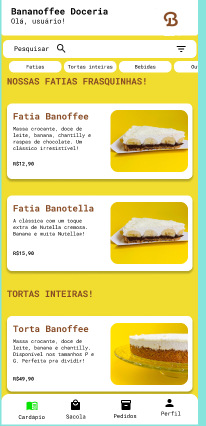  
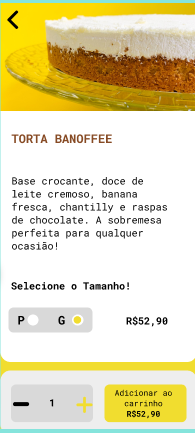  
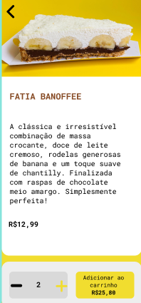

## Protótipo da sacola

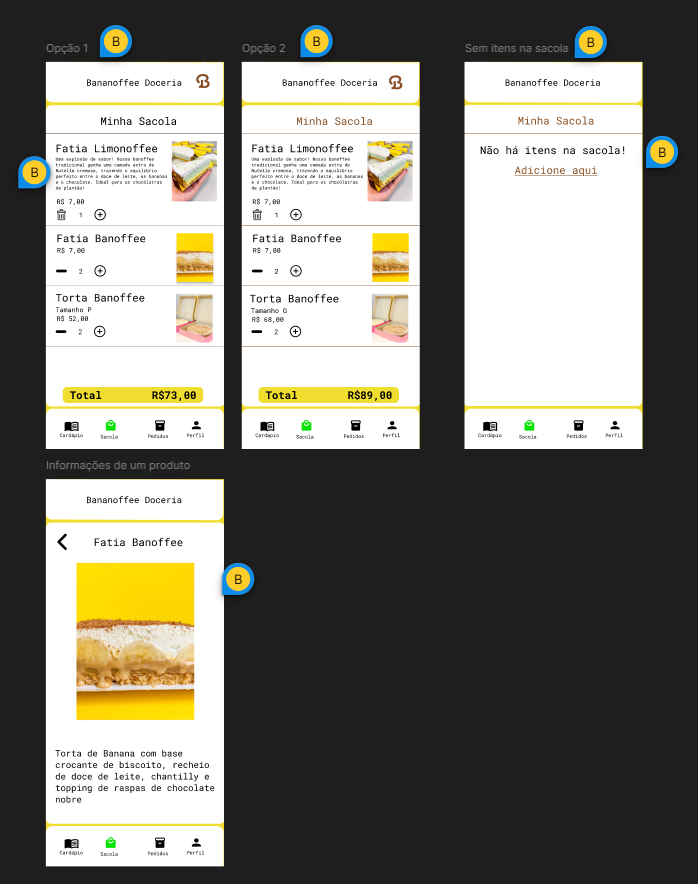

## Protótipo de pedidos

## Protótipo do pagamento

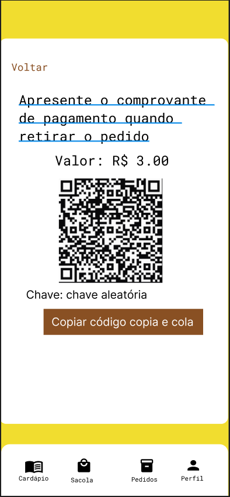

## Protótipo da minha conta

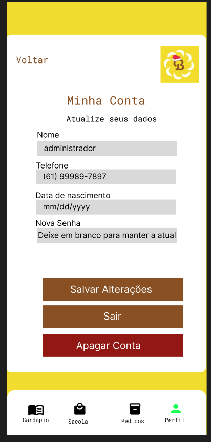

## Protótipo do login

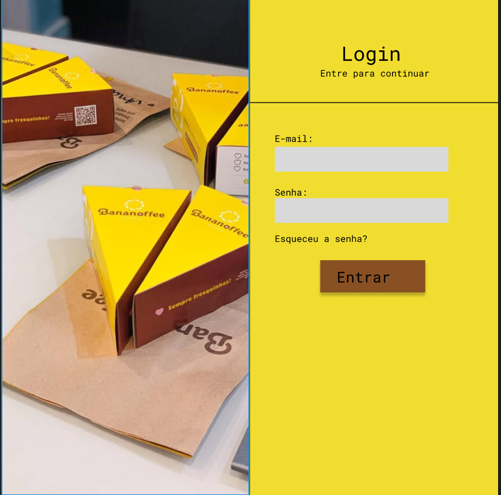

## Protótipo do cadastro

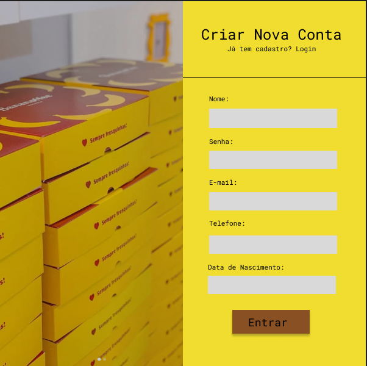

## Protótipo de recuperação de senha

## Protótipo do admin - estoque

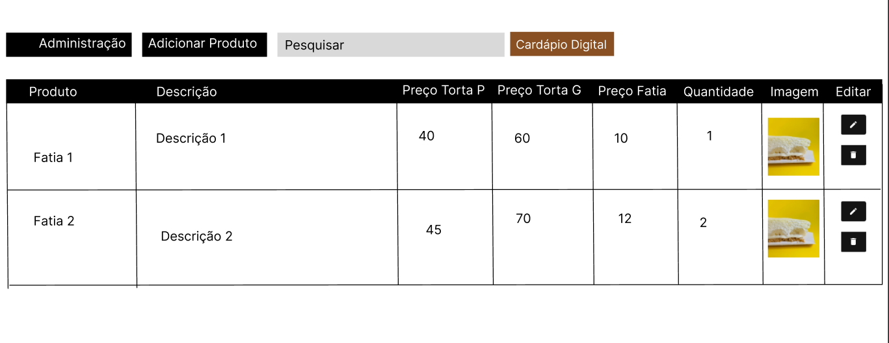

## Protótipo do admin - pedidos

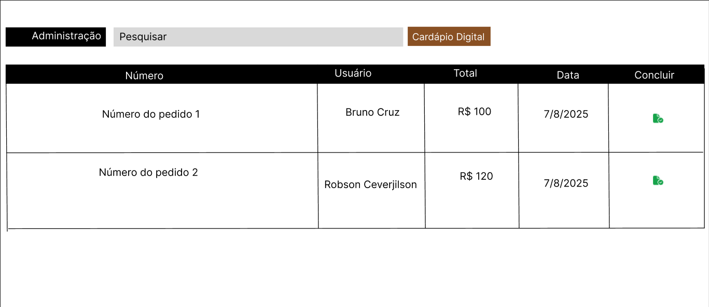

## Protótipo do admin - configurações

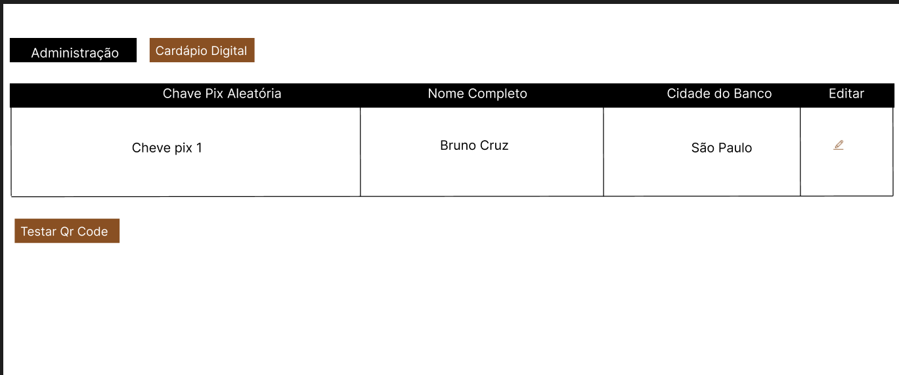

## Histórico de Versão

| Data     | Versão | Descrição             | Autor             |
| -------- | ------ | --------------------- | ----------------- |
| 20/06/25 | 1.0    | Criação do Documento  | Marcos Bezerra    |
| 23/06/25 | 1.1    | Protótipo da sacola   | Marcos Bezerra    |
| 13/07/25 | 1.2    | Protótipos do produto | Guilherme Zanella |
