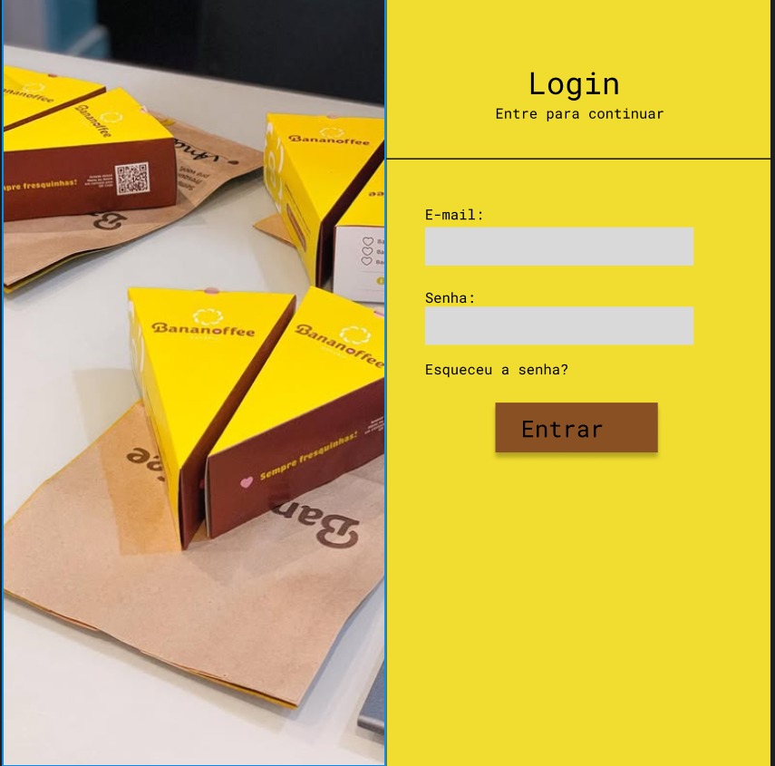
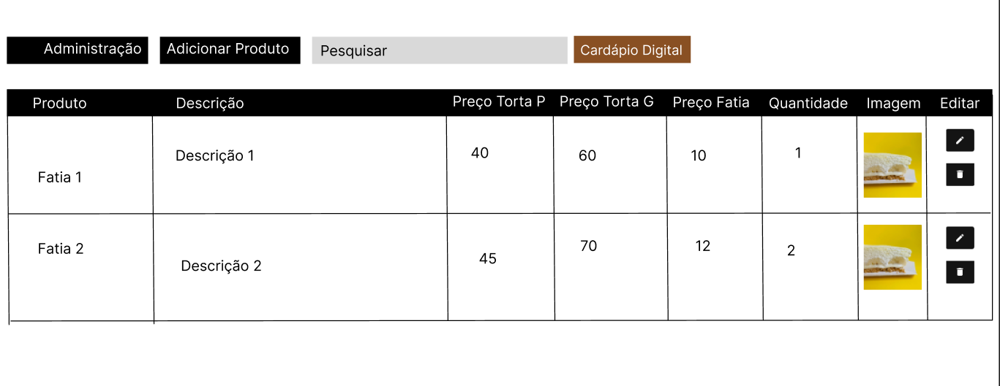

Estes são os protótipos de alta e baixa fidelidade, desenvolvidos no Figma, e utilizados para validar fluxos de navegação, interações e layout antes de iniciarmos o desenvolvimento.

## Protótipo do cardápio

  
  

## Protótipo da sacola

## Protótipo de pedidos

## Protótipo de pagamento

## Protótipo da minha conta

## Protótipo de login

## Protótipo de cadastro

## Protótipo de recuperação de senha

## Protótipo do admin - estoque

## Protótipo do admin - pedidos

## Protótipo do admin - configurações

## Histórico de Versão

| Data     | Versão | Descrição                        | Autor             |
| -------- | ------ | -------------------------------- | ----------------- |
| 20/06/25 | 1.0    | Criação do documento             | Marcos Bezerra    |
| 23/06/25 | 1.1    | Adição da sacola                 | Marcos Bezerra    |
| 10/07/25 | 1.2    | Adição dos protótipos do produto | Guilherme Zanella |
