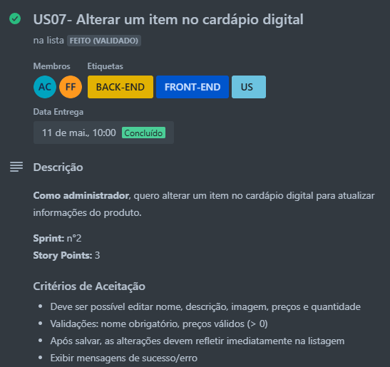

# Aplicação do DoR, DoD e Critérios de Aceitação no Projeto

## Ferramenta Utilizada

Utilizamos o **Trello** como ferramenta de apoio ao gerenciamento das histórias de usuário (US) do projeto. Cada cartão de US no Trello representa uma funcionalidade ou requisito do sistema e contém:

- Checklist de **Definition of Ready (DoR)**
- Checklist de **Definition of Done (DoD)**
- **Critérios de aceitação** e **Regras de negócio**
- Link direto para o **protótipo correspondente**
    - Voce pode ver os protótipos desenvolvidos [aqui](./prototipo.md)
- Anexos e comentários da equipe para discussão
- Etiquetas que indicam o envolvimento de **Front-End** e **Back-End**
- Indicação dos **responsáveis** e **data de entrega**
- O número correspondente da **Sprint** na qual a US vai ser realizada
- Valor do **Story Points** dessa US

> [Link do nosso quadro no Trello](https://trello.com/b/S66Hffzm/bananoffe)
> 

---

### Organização do Quadro Trello

O quadro foi estruturado com as seguintes listas (colunas):

1. **Backlog de Projeto** – Contém todas as US identificadas
2. **Backlog da Sprint** – US selecionadas para a sprint atual
3. **Em andamento** – US sendo implementadas
4. **Em Aceitação** – US finalizadas aguardando validação
5. **Feito (Validado)** – US entregues e aprovadas
6. **Melhoria** – Itens de melhoria contínua e bugs
7. **Leitura** – Materiais de apoio sobre Scrum e processos

---

## Definition of Ready (DoR) e Definition of Done (DoD)

Para cada história de usuário (US) foi atribuído um **checklist personalizado** contendo todos os critérios definidos no nosso **Definition of Ready (DoR)** e **Definition of Done (DoD)**.

Esse processo garantiu que nenhuma US fosse iniciada sem estar totalmente clara e validada, e que só fosse considerada concluída após cumprir todos os critérios de qualidade e validação final.

- Uma **US só era movida para a coluna "Em andamento"** quando **todos os itens do checklist de DoR estavam completos**, ou seja, quando a história estava bem definida, priorizada, estimada e com critérios de aceitação e protótipo vinculados.

- Após ser implementada, a US era movida para **"Em Aceitação"**, onde permanecia **aguardando o feedback da equipe e do cliente**. Somente após a validação completa e a checagem de todos os itens do **checklist de DoD**, ela era movida para a coluna **"Feito (Validado)"**.

###  Itens comuns de cada checklist

Você pode visualizar os checklists completos de DoR e DoD utilizados no projeto acessando este link: [DoR e DoD](../visaoDoProduto/doredod.md)

Esse controle por checklist, feito dentro de cada cartão do Trello, trouxe **transparência, rastreabilidade e organização** ao fluxo de trabalho da equipe.

---

## Critérios de Aceitação e Regras de Negócio

Cada história de usuário (US) possui dois elementos fundamentais para garantir a clareza do que deve ser implementado:

- **Critérios de Aceitação:** definem de forma objetiva o que precisa estar funcionando para que a funcionalidade seja considerada aceita pelo Product Owner. Servem como base para testes e validação da entrega.

- **Regras de Negócio:** representam o conjunto de condições, restrições e comportamentos específicos do domínio da aplicação que precisam ser respeitados no funcionamento da US.

Essas informações estão descritas diretamente em cada cartão do Trello, dentro do corpo descritivo dos Critérios de Aceitação. Essa separação ajudou a equipe a entender **o que deve ser entregue** e **como deve funcionar**, de forma clara e verificável.

Essa prática garantiu maior rastreabilidade das funcionalidades, facilitando tanto o desenvolvimento quanto a validação e aceitação final de cada entrega.

## Evidências Visuais

Abaixo estão capturas de tela de algumas das histórias de usuário no Trello, evidenciando:

- O uso dos checklists de **Definition of Ready (DoR)** e **Definition of Done (DoD)**
- A definição clara dos **critérios de aceitação** e **regras de negócio**
- A vinculação com o **protótipo correspondente**
- O acompanhamento do progresso via movimentação entre as colunas do Trello

Esta seção apresenta apenas as histórias de usuário que compuseram o **MVP** do sistema, em ordem de entrega.

---

#### US01 - Realizar cadastro no sistema

#### US02 - Realizar login no sistema

#### US03 - Alterar conta de usuário

#### US04 - Excluir conta de usuário

#### US05 - Adicionar um item no cardápio digital

#### US06 - Excluir um item no cardápio digital

#### US07 - Alterar um item no cardápio digital

#### US08 - Visualizar o cardápio digital

#### US09 - Adicionar produtos na sacola virtual de compras

#### US11 - Alterar os produtos da sacola virtual

#### US10 - Remover os produtos da sacola virtual

#### US16 - Realizar pedido

#### US13 - Visualizar um pedido

#### US15 - Alterar chave pix da doceria

#### US20 - Realizar pagamento de pedido via pix

---

## Histórico de Versão

| Data       | Versão | Descrição            | Autor        |
| ---------- | ------ | -------------------- | ------------ |
| 13/07/2025 | 1.0    | Criação do Documento | Bruno Garcia |

